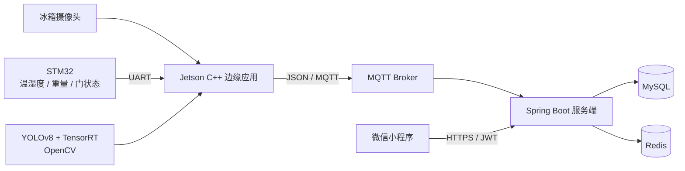
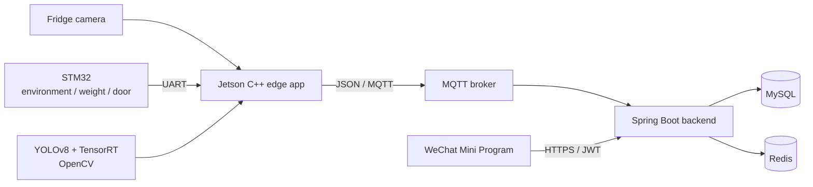

# Smart Fridge / 智慧冰箱

[中文](#中文说明) · [English](#english)

Smart Fridge is an end-to-end intelligent refrigerator prototype. A Jetson edge
application combines camera inference with STM32 sensor data, publishes inventory
snapshots through MQTT, and exposes the result to users through a Spring Boot
service and a WeChat Mini Program.

Smart Fridge 是一套端到端智慧冰箱原型系统。Jetson 边缘端融合摄像头视觉推理与
STM32 传感器数据，通过 MQTT 上报库存快照；Spring Boot 服务端负责持久化、鉴权与
新鲜度计算，微信小程序负责向用户展示设备状态和水果库存。

> [!WARNING]
> The repository currently contains hard-coded database, MQTT, mail, WeChat, JWT,
> and service-address settings. Treat the existing values as development-only:
> rotate exposed credentials and inject secrets through environment variables
> before deployment.
>
> 当前仓库包含硬编码的数据库、MQTT、邮箱、微信、JWT 和服务地址配置。请只将现有值
> 视为开发配置：部署前应轮换已经暴露的凭据，并通过环境变量注入密钥。

---

## 中文说明

### 功能概览

- 读取 STM32 串口上报的温度、湿度、重量与门状态
- 基于 YOLOv8、TensorRT 和 OpenCV 识别水果种类、位置与新鲜度
- 结合开关门事件、重量变化和静态盘点维护冰箱库存
- 检测塑料袋、遮挡、摄像头偏移、光照异常与不稳定画面
- 通过 MQTT 上报设备启动、完整库存快照和视觉异常事件
- 服务端使用 MySQL 存储快照，使用 Redis 完成 JWT 会话和 MQTT 幂等去重
- 微信登录、设备绑定、库存分类/明细、设备状态和提醒设置

当前 C++ 枚举支持苹果、香蕉、橙子、葡萄、梨、芒果和袋装水果。模型实际能识别的
类别取决于所使用的 ONNX/TensorRT 模型。

### 系统架构



边缘程序由四个并行模块组成：

1. `stm32_message_recever` 接收并缓存最近的传感器数据。
2. `cv_model` 负责动态识别、静态盘点及场景可靠性判断。
3. `core` 结合门状态、视觉结果和重量变化维护库存。
4. `mqtt_message_sender` 将结果序列化为 JSON 并发布到 Broker。

服务端订阅同一 MQTT Topic，更新设备状态，并将每条 `snapshot` 当作一个完整库存
批次保存。前端查询设备最后一个批次，因此历史快照不会直接混入当前库存。

### 技术栈

| 层级 | 技术 |
| --- | --- |
| 边缘端 | C++17、CMake、CUDA、TensorRT、OpenCV、Eclipse Paho MQTT C/C++ |
| 硬件 | NVIDIA Jetson、USB/V4L2 摄像头、STM32 串口 |
| 服务端 | Java 17、Spring Boot 3.2、MyBatis-Plus、Spring Integration MQTT |
| 数据 | MySQL 8、Redis |
| API | JWT、Knife4j / OpenAPI |
| 客户端 | 微信小程序、Vant Weapp |
| 辅助工具 | Python 3、OpenCV、NumPy |

### 目录结构

```text
.
├── common/                   # C++ 配置和日志
├── core/                     # 边缘端编排、库存融合与主程序
├── cv_model/                 # TensorRT 推理、相机与静态场景分析
│   └── yolov8/               # ONNX/engine 模型及 Python 调试脚本
├── stm32_message_recever/    # STM32 串口接收（目录名沿用当前拼写）
├── mqtt_message_sender/      # MQTT 连接与 JSON 上报
├── third_part/               # OpenCV、TensorRT、Paho 的 CMake 适配
├── config/                   # 边缘端配置和空冰箱参考图
├── tools/                    # 构建、背景采集和位置标定工具
└── frontend_backend/
    ├── Smart_Refrigerator_wx/Smart_Refrigerator_wx/  # Spring Boot
    └── WeChatProject/WeChatProject/                   # 微信小程序
```

### 快速开始

#### 1. 准备基础设施

启动 MySQL 8、Redis 和 MQTT Broker，并保证 Jetson 与服务端使用相同的 Broker、
用户名、密码、Topic（默认 Topic 为 `smartfridge/data`）。

初始化数据库：

```bash
cd frontend_backend/Smart_Refrigerator_wx/Smart_Refrigerator_wx
mysql -u root -p < sql/init.sql
```

`sql/` 下其余脚本用于旧数据库的增量迁移。全新环境优先使用 `sql/init.sql`，不要再
重复执行迁移脚本。

#### 2. 启动服务端

要求 Java 17 和 Maven 3.8+。先修改 `src/main/resources/application.yml`，或用
Spring Boot 环境变量覆盖数据库、Redis、MQTT、微信、邮件及加密配置。例如：

```bash
cd frontend_backend/Smart_Refrigerator_wx/Smart_Refrigerator_wx

export SPRING_DATASOURCE_PASSWORD='replace-me'
export SPRING_MAIL_PASSWORD='replace-me'
export MQTT_BROKER_URL='tcp://127.0.0.1:1883'
export MQTT_PASSWORD='replace-me'
export WECHAT_SECRET='replace-me'
export JWT_SECRET='replace-with-at-least-256-bit-secret'
export CRYPTO_PHONE_KEY='replace-with-a-32-character-key'

mvn spring-boot:run
```

服务默认监听 `http://localhost:8080/api`。启动后可访问：

- Knife4j：`http://localhost:8080/api/doc.html`
- OpenAPI JSON：`http://localhost:8080/api/v3/api-docs`

Redis 对登录会话是必需的；只有 MQTT 消息去重在 Redis 故障时会降级运行。

#### 3. 配置并构建 Jetson 边缘端

建议使用 Jetson/Linux。当前 CMake 配置显式查找 Jetson 的 aarch64 TensorRT 路径，
普通 x86 电脑不能直接完成完整构建。

依赖：

- CMake 3.10+
- 支持 C++17 的编译器
- CUDA 与 TensorRT
- OpenCV 开发库
- Eclipse Paho MQTT C（`paho-mqtt3as`）与 C++（`paho-mqttpp3`）开发库
- 摄像头及串口设备访问权限

编辑 `config/smartfridge.conf`，至少核对以下配置：

- `mqtt.*`：Broker、认证、Topic 和客户端 ID
- `serial.*`：串口设备及波特率
- `cv.model_path`、`cv.model_onnx_path`：模型绝对路径
- `cv.background_paths`、`cv.bag_background_path`：空冰箱参考图
- `camera.*`：摄像头编号、分辨率及曝光参数
- `device.id`：边缘端会将 `10001` 格式化为设备号 `SN-10001`

目前 `ConfigManager` 默认从
`/home/nvidia/ws/smartF/config/smartfridge.conf` 读取配置，仓库内的模型路径也按该
部署目录填写。请将项目部署到此路径，或修改
`common/include/config_manager.h` 和配置文件中的绝对路径后重新构建。

```bash
cmake -S . -B build
cmake --build build -j"$(nproc)"
ctest --test-dir build --output-on-failure
sudo ./build/bin/smart_fridge_app
```

也可使用 `tools/rebuild_run.sh` 清理、重建并以 `sudo` 启动程序。脚本会删除整个
`build/` 的内容，使用前请确认其中没有需要保留的文件。

没有 STM32 时，可以构建 Mock 门状态模式：

```bash
cmake -S . -B build-mock -DCMAKE_CXX_FLAGS="-DUSE_MOCK_STM32=1"
cmake --build build-mock -j"$(nproc)"
sudo ./build-mock/bin/smart_fridge_app
```

Mock 模式只替代 STM32 串口，摄像头、模型、CUDA/TensorRT 和 MQTT 仍然需要可用。

#### 4. 标定摄像头

摄像头应先固定在最终位置，并在空冰箱状态采集背景：

```bash
python3 tools/capture_empty_background.py \
  --camera 0 --output config/fridge_empty_bg.jpg

python3 tools/camera_location_calibration.py \
  --camera 0 \
  --output /tmp/location_calibration.conf \
  --capture /tmp/fridge_frame.jpg
```

按顺序点击底板的“左上 → 右上 → 右下 → 左下”，再把输出参数复制到
`config/smartfridge.conf`。更详细说明见
[`tools/CAMERA_CALIBRATION.md`](tools/CAMERA_CALIBRATION.md)。

#### 5. 运行微信小程序

```bash
cd frontend_backend/WeChatProject/WeChatProject
npm install
```

然后使用微信开发者工具导入该目录，执行“工具 → 构建 npm”。部署前还需要：

1. 将 `miniprogram/utils/request.js` 中的 `BASE_URL` 改为服务端 HTTPS 地址。
2. 在微信公众平台配置合法 request 域名。
3. 确保小程序 AppID 与服务端 `wechat.appid` 一致。
4. 在数据库中创建/绑定与边缘上报一致的设备号，例如 `SN-10001`。

### MQTT 消息

边缘端发布三类事件：

- `startup`：设备启动，仅刷新在线状态。
- `snapshot`：可信的完整库存快照。
- `recognition_error`：场景不可信，不覆盖库存，并更新视觉异常状态。

简化后的快照结构如下：

```json
{
  "event_type": "snapshot",
  "recognition_status": 0,
  "device_id": "SN-10001",
  "message_id": "MSG_123456",
  "message_time": "2026-07-02 12:00:00",
  "refrigerator_info": {
    "temperature": 4.0,
    "humidity": 65.0
  },
  "fruit_num": 1,
  "fruits": [
    {
      "id": 1,
      "type": "1",
      "fresh_status": 90,
      "put_in_time": "2026-07-02 11:30:00",
      "weight": 180.0,
      "coordinate_x": 128,
      "coordinate_y": 96
    }
  ]
}
```

水果 `type` 当前由边缘端发送数字字符串，服务端会将 `1` 到 `7` 映射为水果字典项；
`fresh_status` 为百分制视觉分数。服务端使用 `device_id + message_id` 做幂等处理。

### 主要 API

所有路径均以 `/api` 开头。除登录和设备状态查询外，大多数接口要求
`Authorization: Bearer <token>`。

| 方法 | 路径 | 说明 |
| --- | --- | --- |
| POST | `/auth/login` | 使用微信登录 code 换取 JWT |
| POST | `/auth/logout` | 登出 |
| POST | `/auth/refresh` | 刷新 JWT |
| GET | `/device/status?deviceSn=...` | 查询设备状态 |
| POST | `/device/bind?deviceSn=...` | 绑定设备 |
| GET | `/device/list` | 查询已绑定设备 |
| GET | `/inventory/list?deviceSn=...` | 查询最新库存明细 |
| GET | `/inventory/fruitStatistic?deviceSn=...` | 查询最新库存分类统计 |
| GET | `/user/info` | 查询用户信息 |
| POST | `/user/push-setting` | 修改推送设置 |
| POST | `/user/update-email` | 修改提醒邮箱 |

以运行时生成的 OpenAPI 文档为接口字段的最终依据。

### 测试与诊断

```bash
# C++ 单元/回放测试（仍需先满足顶层 CUDA、TensorRT、OpenCV 和 MQTT 依赖）
cmake -S . -B build -DBUILD_TESTING=ON
cmake --build build -j"$(nproc)"
ctest --test-dir build --output-on-failure

# Java 测试
cd frontend_backend/Smart_Refrigerator_wx/Smart_Refrigerator_wx
mvn test
```

`cv.diagnostic_capture_enable=1` 会将识别帧和中间掩码写入
`logs/recognition_debug`，有利于标定，但会持续占用磁盘；稳定运行时建议关闭。

### 当前限制

- 边缘端和小程序仍包含部署路径/IP 的硬编码，尚未提供统一配置或命令行参数。
- CMake 的 TensorRT 搜索路径面向 Jetson aarch64，尚未做跨平台适配。
- 小程序“鲜果星球”页面请求 `/eco/stats`，当前服务端没有对应 Controller。
- `StatsController` 及库存手工修正/删除接口目前被注释，不能使用。
- `/auth/login` 当前保留了 `code=test` 调试入口，生产环境必须删除或禁用。
- `tools/pull_code.sh` 会强制丢弃本地修改，不应在有未提交工作时运行。
- 仓库尚未声明许可证。

---

## English

### Features

- Reads temperature, humidity, weight, and door state from an STM32 over serial
- Detects fruit type, position, and freshness with YOLOv8, TensorRT, and OpenCV
- Combines door events, weight changes, and static recognition into inventory snapshots
- Detects bags, occlusion, camera movement, invalid lighting, and unstable frames
- Publishes startup, inventory snapshot, and recognition-error events over MQTT
- Stores snapshots in MySQL and uses Redis for JWT sessions and MQTT deduplication
- Supports WeChat login, device binding, inventory views, device status, and alert settings

The C++ enum currently covers apple, banana, orange, grape, pear, mango, and
bagged fruit. Actual recognition classes depend on the selected model.

### Architecture



The edge application runs four concurrent modules: the STM32 receiver, CV
engine, core inventory coordinator, and MQTT sender. The backend subscribes to
the same topic and stores each `snapshot` as a complete inventory batch. Client
queries use the device's latest batch, keeping historical snapshots separate
from the current view.

### Technology

| Layer | Stack |
| --- | --- |
| Edge | C++17, CMake, CUDA, TensorRT, OpenCV, Eclipse Paho MQTT C/C++ |
| Hardware | NVIDIA Jetson, USB/V4L2 camera, STM32 serial |
| Backend | Java 17, Spring Boot 3.2, MyBatis-Plus, Spring Integration MQTT |
| Data | MySQL 8, Redis |
| API | JWT, Knife4j / OpenAPI |
| Client | WeChat Mini Program, Vant Weapp |
| Tools | Python 3, OpenCV, NumPy |

### Repository layout

```text
.
├── common/                   # C++ configuration and logging
├── core/                     # Edge orchestration and inventory fusion
├── cv_model/                 # TensorRT inference, camera, scene analysis
├── stm32_message_recever/    # STM32 serial receiver (existing spelling)
├── mqtt_message_sender/      # MQTT transport and JSON serialization
├── third_part/               # CMake adapters for native dependencies
├── config/                   # Edge configuration and empty-fridge reference
├── tools/                    # Build and camera calibration utilities
└── frontend_backend/
    ├── Smart_Refrigerator_wx/Smart_Refrigerator_wx/  # Spring Boot backend
    └── WeChatProject/WeChatProject/                   # WeChat Mini Program
```

### Quick start

#### 1. Infrastructure

Start MySQL 8, Redis, and an MQTT broker. The Jetson and backend must use the
same broker credentials and topic (`smartfridge/data` by default).

```bash
cd frontend_backend/Smart_Refrigerator_wx/Smart_Refrigerator_wx
mysql -u root -p < sql/init.sql
```

The other files under `sql/` are incremental migrations for older databases.
For a fresh deployment, use `sql/init.sql` without replaying those migrations.

#### 2. Backend

Java 17 and Maven 3.8+ are required. Update `application.yml` or override its
values with Spring Boot environment variables:

```bash
cd frontend_backend/Smart_Refrigerator_wx/Smart_Refrigerator_wx

export SPRING_DATASOURCE_PASSWORD='replace-me'
export SPRING_MAIL_PASSWORD='replace-me'
export MQTT_BROKER_URL='tcp://127.0.0.1:1883'
export MQTT_PASSWORD='replace-me'
export WECHAT_SECRET='replace-me'
export JWT_SECRET='replace-with-at-least-256-bit-secret'
export CRYPTO_PHONE_KEY='replace-with-a-32-character-key'

mvn spring-boot:run
```

The API is served at `http://localhost:8080/api`. Knife4j is available at
`http://localhost:8080/api/doc.html`, and the OpenAPI document at
`http://localhost:8080/api/v3/api-docs`.

Redis is required for login sessions. Only MQTT deduplication has a
Redis-unavailable fallback.

#### 3. Jetson edge application

The current native build targets Jetson/Linux and explicitly searches aarch64
TensorRT locations. It requires CMake 3.10+, a C++17 compiler, CUDA, TensorRT,
OpenCV, Eclipse Paho MQTT C/C++, and access to the camera and serial devices.

Edit `config/smartfridge.conf`, particularly:

- `mqtt.*` for broker connectivity
- `serial.*` for the STM32 serial device
- `cv.model_path` and `cv.model_onnx_path`
- `cv.background_paths` and `cv.bag_background_path`
- `camera.*`
- `device.id` (`10001` is serialized as `SN-10001`)

`ConfigManager` currently loads
`/home/nvidia/ws/smartF/config/smartfridge.conf`, and the checked-in model paths
use the same deployment root. Deploy there, or update
`common/include/config_manager.h` and the absolute paths in the configuration
before rebuilding.

```bash
cmake -S . -B build
cmake --build build -j"$(nproc)"
ctest --test-dir build --output-on-failure
sudo ./build/bin/smart_fridge_app
```

`tools/rebuild_run.sh` provides a clean-build-and-run workflow, but deletes all
contents of `build/` first.

To replace only the STM32 input with simulated door events:

```bash
cmake -S . -B build-mock -DCMAKE_CXX_FLAGS="-DUSE_MOCK_STM32=1"
cmake --build build-mock -j"$(nproc)"
sudo ./build-mock/bin/smart_fridge_app
```

Camera, model, CUDA/TensorRT, and MQTT are still required in mock mode.

#### 4. Camera calibration

Fix the camera in its final position, empty the fridge, and run:

```bash
python3 tools/capture_empty_background.py \
  --camera 0 --output config/fridge_empty_bg.jpg

python3 tools/camera_location_calibration.py \
  --camera 0 \
  --output /tmp/location_calibration.conf \
  --capture /tmp/fridge_frame.jpg
```

Click the usable board corners in top-left, top-right, bottom-right, bottom-left
order and copy the generated values into `config/smartfridge.conf`. See
[`tools/CAMERA_CALIBRATION.md`](tools/CAMERA_CALIBRATION.md) for details.

#### 5. WeChat Mini Program

```bash
cd frontend_backend/WeChatProject/WeChatProject
npm install
```

Import that directory in WeChat DevTools and run “Tools → Build npm.” Before
deployment:

1. Change `BASE_URL` in `miniprogram/utils/request.js` to the backend HTTPS URL.
2. Register the request domain in the WeChat administration console.
3. Keep the Mini Program AppID consistent with backend `wechat.appid`.
4. Create or bind the same device ID reported by the edge, such as `SN-10001`.

### MQTT contract

The edge publishes `startup`, `snapshot`, and `recognition_error` events. A
snapshot includes `device_id`, `message_id`, environment readings, fruit count,
and fruit items with track ID, numeric type string, freshness score, weight,
entry time, and 0–255 coordinates. The backend maps type strings `1` through `7`
to dictionary categories and deduplicates by `device_id + message_id`.

See the JSON example in the [Chinese MQTT section](#mqtt-消息).

### Main API

All routes are under `/api`. Most routes require
`Authorization: Bearer <token>`; login and device status are public.

| Method | Route | Purpose |
| --- | --- | --- |
| POST | `/auth/login` | Exchange a WeChat code for a JWT |
| POST | `/auth/logout` | Log out |
| POST | `/auth/refresh` | Refresh a JWT |
| GET | `/device/status?deviceSn=...` | Read device status |
| POST | `/device/bind?deviceSn=...` | Bind a device |
| GET | `/device/list` | List bound devices |
| GET | `/inventory/list?deviceSn=...` | Read latest inventory items |
| GET | `/inventory/fruitStatistic?deviceSn=...` | Read latest category totals |
| GET | `/user/info` | Read user information |
| POST | `/user/push-setting` | Update push settings |
| POST | `/user/update-email` | Update the alert email |

Use the generated OpenAPI document as the source of truth for request and
response fields.

### Tests and diagnostics

```bash
# C++ tests; top-level native dependencies are still required
cmake -S . -B build -DBUILD_TESTING=ON
cmake --build build -j"$(nproc)"
ctest --test-dir build --output-on-failure

# Java tests
cd frontend_backend/Smart_Refrigerator_wx/Smart_Refrigerator_wx
mvn test
```

With `cv.diagnostic_capture_enable=1`, recognition frames and intermediate masks
are written to `logs/recognition_debug`. This is useful during calibration but
should normally be disabled to avoid continuous disk usage.

### Known limitations

- Edge paths and the Mini Program service URL are still hard-coded.
- TensorRT discovery currently targets Jetson aarch64 rather than being portable.
- The Mini Program's Eco page requests `/eco/stats`, but no matching backend
  controller currently exists.
- `StatsController` and manual inventory correction/removal endpoints are disabled.
- `/auth/login` contains a `code=test` debug path that must be removed in production.
- `tools/pull_code.sh` forcefully discards local changes.
- No project license has been declared.
